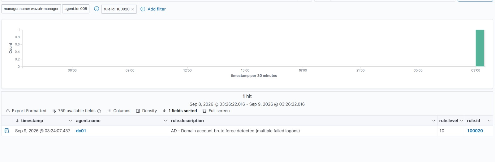

# Active Directory Domain Account Brute Force

## Objective

Detect a brute force attack against an Active Directory domain account by
monitoring the Domain Controller, and turn dozens of raw failure events into
a single actionable alert.

## Setup

A Windows Server 2022 Domain Controller runs the `lab.local` domain with a
handful of domain users, one of them a Domain Admin. A Wazuh agent on the DC
ships the Windows Security event log to the SIEM. This matters because domain
authentication is handled by the DC, so the failures are logged there, not on
the workstation.

## Attack

Repeated failed domain logons against a domain account:

    for /L %i in (1,1,7) do net use \\192.168.10.5\IPC$ /user:LAB\<user> wrongpass%i

Each attempt produced a Windows Event 4625 (an account failed to log on) on
the Domain Controller.

## Detection

A custom Wazuh rule (100020) watches for repeated 4625 events and correlates
five or more within 120 seconds into one brute force alert:

    <rule id="100020" level="10" frequency="5" timeframe="120">
      <if_matched_sid>60122</if_matched_sid>
      <description>AD - Domain account brute force detected (multiple failed logons)</description>
      <mitre><id>T1110</id></mitre>
      <group>authentication_failed,ad_attack,</group>
    </rule>

Instead of an analyst scrolling through seven near identical failure events,
the SIEM raises a single level 10 alert that says "this is a brute force,"
tagged with the target account, the source, and the MITRE technique.

A companion rule (100021) fires on Event 4740 when an account is locked out,
which is the natural follow on to a sustained brute force.

## Evidence

Seven failed domain logons correlated into a single brute force alert (rule 100020) on the Domain Controller:

## Why this matters

The Domain Controller is the highest value log source in a Windows
environment. Getting DC authentication events into the SIEM and writing
correlation logic on top of them is a core SOC task, and it maps directly to
the access management and Active Directory requirements that show up in job
descriptions.

## MITRE ATT&CK

- T1110 Brute Force (Credential Access)
