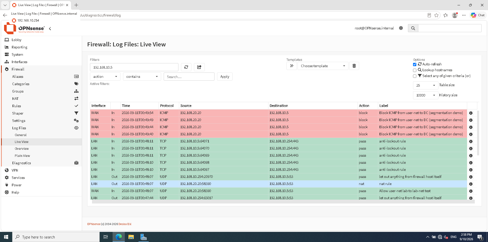

# Network Segmentation with a Firewall

## Objective

Split the flat lab network into two segments separated by a firewall, and
show that traffic between them is controlled rather than open. This is the
difference between "everything can talk to everything" and a real network
where a compromised workstation cannot freely reach the servers.

## Setup

An OPNsense firewall was added between two segments:

- **lab-net (192.168.10.0/24)** servers: Wazuh SIEM and the Domain Controller
- **user-net (192.168.20.0/24)** client side: the Windows workstation and the
  attacker (Kali)

OPNsense routes and filters everything that crosses between the two. The
Windows workstation, which used to sit on the same flat network as the
servers, was moved to user-net so that its traffic to the servers now has to
pass through the firewall.

## Routing note

Because the workstation is multi-homed (it also has a NAT adapter for
updates), its default route pointed at the NAT gateway and hijacked all
traffic. A specific route was added so that only lab-net traffic goes through
the firewall:

    route -p add 192.168.10.0 mask 255.255.255.0 192.168.20.1

A matching return route was added on the Domain Controller. Source NAT on the
firewall (translate to the LAN address) handles the reply path for the rest.

## Selective access control

Two rules on the firewall, evaluated top to bottom:

1. Block ICMP from user-net to the Domain Controller (192.168.10.5)
2. Allow everything else from user-net to lab-net

The result: the workstation can still resolve the domain over DNS and stay
joined, but it cannot ping the Domain Controller. Same source, same
destination, different outcome depending on the protocol. That is the point
of a firewall, not a blunt "block all" but a policy.

## Verification

From the workstation:

- `ping 192.168.10.5` times out (blocked by the firewall)
- `nslookup lab.local 192.168.10.5` succeeds (DNS allowed)

The firewall log shows both: the blocked ICMP in red, the allowed DNS in
green, and the NAT translation, all for the same pair of hosts.

## SIEM integration

OPNsense forwards its logs to the Wazuh SIEM over syslog (UDP 514), so the
firewall becomes another log source in the same central view as the endpoint
and Active Directory logs.

## Why this matters

Segmentation with rule-based access control and centralized logging is a core
requirement in security engineering roles. This scenario shows the full loop:
design the segments, enforce a policy on the firewall, prove it is selective,
and ship the logs to the SIEM.

## MITRE ATT&CK

- Relates to mitigation M1030 Network Segmentation (defensive control rather
  than an attack technique)
