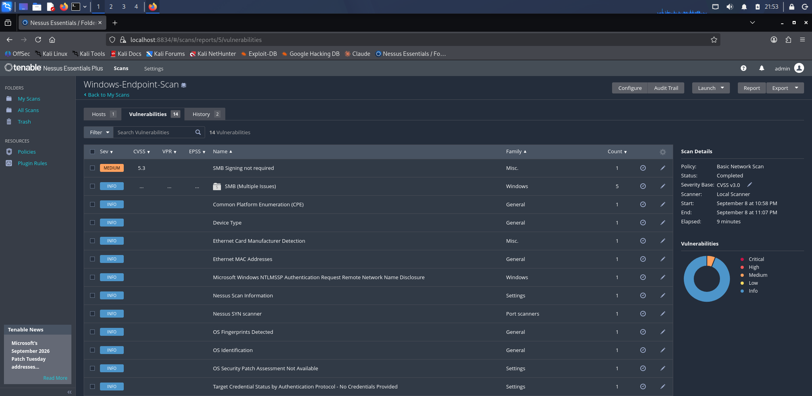
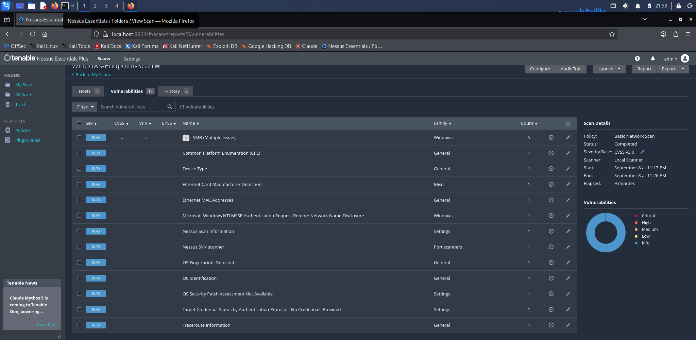

# Vulnerability Management: SMB Signing

## Objective

Run a vulnerability scan, fix a finding, and verify the fix with a rescan.
The full detect, remediate, verify loop rather than just producing a scan
report.

## Tool

Nessus Essentials, installed on the Kali box, scanning the Windows endpoint
with a Basic Network Scan.

## Detection

The first scan returned one Medium finding:

- **SMB Signing not required** (Nessus plugin 57608, CVSS 5.3)
- Risk: without required SMB signing, an attacker in a man in the middle
  position can tamper with SMB traffic.

Everything else was informational. For an unauthenticated scan of a single
workstation, one real finding is a realistic result.

## Remediation

SMB signing was enforced on the endpoint through Group Policy:

- Computer Configuration > Windows Settings > Security Settings > Local
  Policies > Security Options
- "Microsoft network server: Digitally sign communications (always)" set to
  Enabled
- "Microsoft network client: Digitally sign communications (always)" set to
  Enabled
- Applied with `gpupdate /force`

## Verification

A second scan of the same host returned zero Medium findings. The SMB signing
issue was gone, confirming the remediation worked rather than assuming it did.

| | Medium findings |
|--|--|
| Before | 1 (SMB signing) |
| After | 0 |

## Evidence

Before remediation, the scan found one Medium (SMB signing):

After enforcing SMB signing and rescanning, the finding is gone:

## Why this matters

Finding vulnerabilities is only half the job. The part that counts in an
operational role is closing them and proving they are closed. This is a small
but complete example of that cycle, and it maps directly to the vulnerability
management expectations in security engineering roles.
